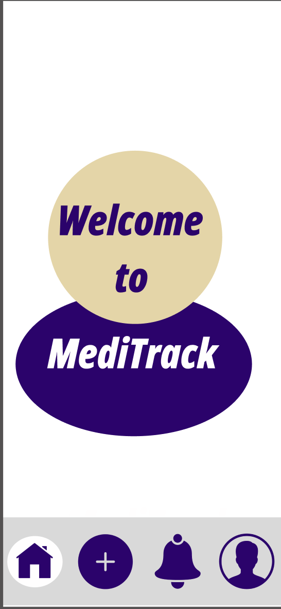
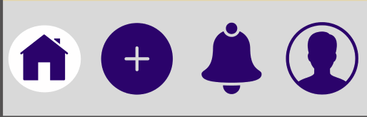
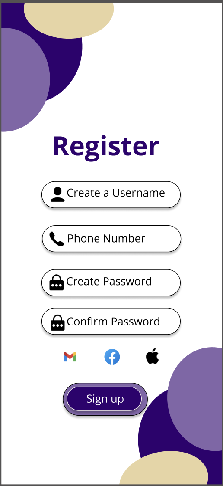
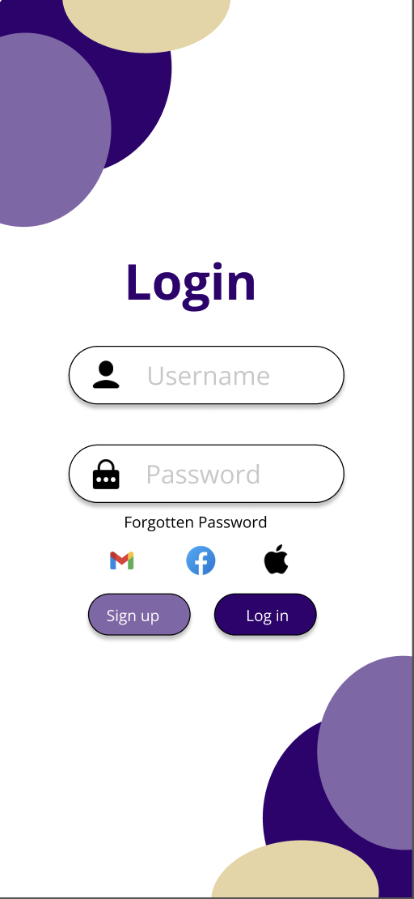
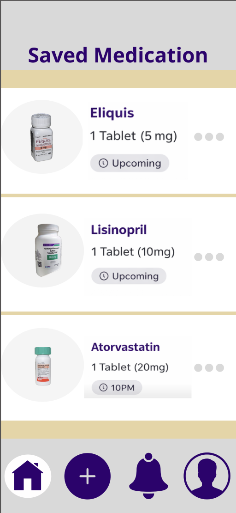
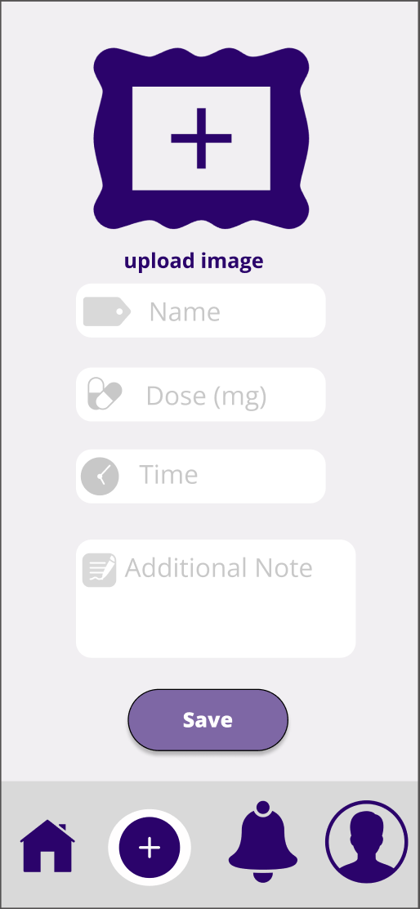
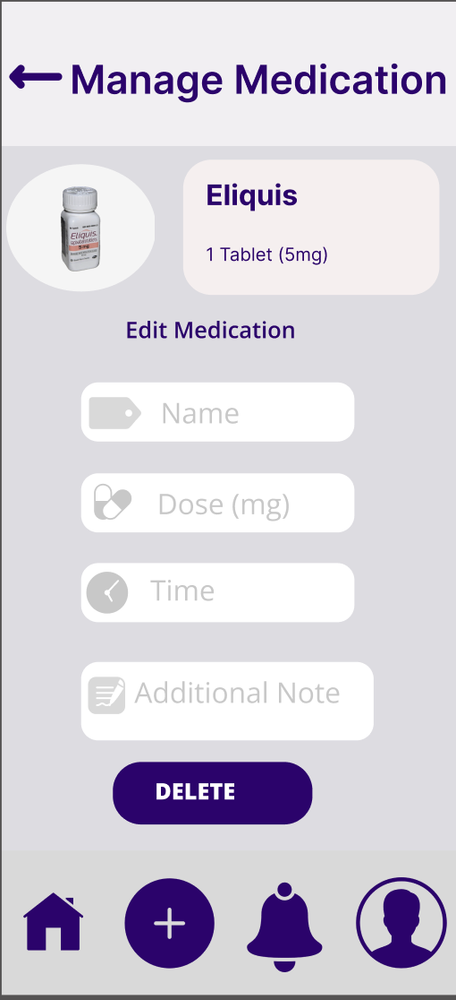
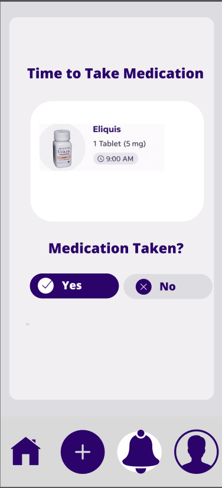

# Problem Statement

Imagine forgetting to take a dose of your insulin or warfarin, medications that have major effects with little changes or taking an expired over-the-counter medication because it has been sitting on your shelf for so long.  Medication nonadherence is a significant public health issue in the United States, especially among older adults on multiple medications. This issue is highly related to global health priorities, as it reflects the United Nations Department of Economic and Social Affairs’ emphasis that “a healthy life and well-being for everyone is a key sustainable development goal” (United Nations, 2025). This case highlights the serious implications of everyday errors in medication use that result in severe health problems.

As shown in different  statistics, the problem of medication nonadherence does not occur independently; rather, it is a major problem that afflicts a large number of individuals.  Research indicates that nearly 89% of adults aged 65 years and older use at least one prescription medication, and 54% use four or more medications simultaneously (National Institute on Aging, 2023). Additionally, studies indicate that nearly half of patients do not adhere to their medications properly. In patients who experience multiple chronic conditions, the rates of non-adherence vary between 44% and 76.5% (Kardas et al., 2024). This indicates that millions of patients, especially seniors, are in danger of missing a dose, taking too much of a medication, or failing to manage their medications properly. 

Medication non-adherence is an ongoing and growing concern. In the United States  it results in nearly 125,000 deaths annually and many hospitalizations that could be prevented (Kardas et al., 2024). Recent research indicates that this issue is likely to worsen with more elderly people having multiple long-term health conditions, which could increase healthcare costs and cause many people to be hospitalized even though it could have been avoided.This situation has significant implications not only for the individual but also for the health care system.

Many factors contribute to medication non-adherence.. First, studies have shown that elderly patients often experience difficulties in complex medication regimens, memory problems, and having to cope with multiple co-occurring illnesses, which can lead to confusion in taking their medication (National Institute on Aging, 2023). Other reasons for non-adherence to medication include side effects, cost, and storage, which can prevent patients from taking their medication as prescribed.(U.S. Food and Drug Administration, 2023).  For these reasons, it is difficult for patients to adhere to the medication regimen recommended to them.

Several solutions exist to address medication nonadherence in the United States.  Some of these solutions include Medication Therapy Management(MTM), as well as patient education. In this approach, a patient’s medication is reviewed, and they are advised on how to use their medication. Other public health organizations have used educational approaches to ensure that people use their medication safely. Although this method has been effective for a wide number of people, there are still cases where people cannot completely remember or follow medication guidelines, such as forgetting to take medication or improper storage, which makes it difficult to completely solve the problem (Centers for Medicare & Medicaid Services, 2023).

## References
United Nations. (2025). Goal 3: Ensure healthy lives and promote well-being for all at all ages. United Nations Department of Economic and Social Affairs. https://sdgs.un.org/goals/goal3

Kardas, P., Bennett, B., Borah, B., Burnier, M., Daly, C., Hiligsmann, M., Menditto, E., Peterson, A. M., Slejko, J. F., Tóth, K., Unni, E., & Ágh, T. (2024). Medication non-adherence: reflecting on two decades since WHO adherence report and setting goals for the next twenty years. Frontiers in pharmacology, 15, 1444012. https://doi.org/10.3389/fphar.2024.1444012

National Institute on Aging. (2023). Taking medicines safely as you age. https://www.nia.nih.gov/health/medicines-and-medication-management/taking-medicines-safely-you-age

Centers for Medicare & Medicaid Services. (2023). Medication therapy management. https://www.cms.gov/medicare/coverage/prescription-drug-coverage-contracting/medication-therapy-management?utm

U.S. Food and Drug Administration. (2023). Expiration dates: Questions and answers. https://www.fda.gov/drugs/pharmaceutical-quality-resources/expiration-dates-questions-and-answers?

# Solution summary

MediTrack will help users take their medication more regularly, especially if they have a busy lifestyle or if they have simply too many medications to keep track of. The app sends reminders with the option for users to select whether they took the medicine or not. This makes the process easier compared to manual methods (eg: writing it down) and is a faster way of regularly logging medicine intake. With the image upload and label assignment feature, users will be able to take a picture of their medication and name it for future reference. Prescriptions only have text, so when the app reminds the user to take their medicine, the reminder message will include the image and label. This reduces the friction of scrambling to find the right medication and makes it easier for users to manage multiple medications at once. Their image and label will be stored in the app along with data for their other medications, essentially serving as a “virtual medicine cabinet”. 

# Design

## Interaction details

## Welcome Page
- Purple and gold color theme (representing UW colors!)
    - Shows the name of our project, which is “MediTrack”

## Bottom Navigation Bar
- Appears on all the pages after the user has successfully logged in
- Includes icons for the Home, Add Medication, Reminders, and Profile
- When a user clicks on one of the icons, it will directly route them to the designated page
- An icon highlighted in white represents the page the user is currently on
- This navigation bar will remain fixed at the bottom for quick access

## Sign Up Page
- Four rounded rectangles stacked vertically with a few pixels of space in between - will take user input
- First rectangle: user can type in the username that they wish to be registered as
- Second rectangle: user can type in their phone number
- Third rectangle: user can put in their password that they wish to use whenever they want to log in
- Fourth rectangle: user can confirm their password and it must be the same as whatever they typed in the third rectangle
- Three other options for logging in: Google, Facebook, Apple
- If a user wants to register with their Google, Facebook, or Apple account in our database, then they can click on one of the icons
- Makes registration more efficient

## Login Page
- Two rounded rectangles stacked vertically with a few pixels of space in between - will take in user input
- First rectangle will take in the username that should already exist in the database
- Second rectangle will take in the password that is associated with the corresponding username
- “Forgetten Password” clickable link underneath the second rounded rectangle - will redirect the user to a page where they can type in their email and new password
- Three other options for logging in: Google, Facebook, Apple
- If a user already has a registered Google, Facebook, or Apple account in our database, then they can click on one of the icons
- Two purple buttons - “Sign Up” and “Log In”
- If the user accidentally ended up on the login page without already having an account, they can go to the page where they can create an account by clicking on “Sign Up”

## Saved Medication Cabinet Page
- Shows a list of all the medications that the user has added into the system
- The list contains multiple rectangles (row), where each rectangle represents a single medication
- Each rectangle will contain a picture of the medication (taken by the user in the “Add Medicine” page), the name of the medication, dosage amount needed to take per time, and a time of when the user will get the next reminder
- There is also three dots on the right side of each rectangle, allowing the user to edit the medication (described in the “Medication Management” page)

## Add Medication Page
- Allows users to add a new medication to their virtual cabinet and schedule reminders.
Layout:
- Title at top: “Add Medication”
- Form with vertically stacked rounded input fields
- Image upload section at top
- Save button at bottom
- First section: user can upload or take a picture of their medication
- Once uploaded, a preview of the image will be shown
- Second rectangle: user can type in the name of the medication (required)
- Third rectangle: user can type in the dosage amount (e.g., “500mg” or “1 pill”)
- Fourth rectangle: user can select the reminder time using a time picker
- Fifth section: user can select the days of the week (M T W T F S S) using toggle buttons
- Sixth rectangle: user can select the expiration date using a date picker
- Seventh rectangle: optional notes field for additional information
- A purple “Save” button at the bottom of the page
- When the user clicks “Save”:
    - The system will validate the inputs
    - If all required fields are filled correctly, the medication will be saved into the system
    - The user will then be redirected to the “Saved Medication Cabinet” page
- If there are errors:
    - Missing medication name → show error message
    - No reminder time selected → show error message
    - Expiration date in the past → show error message
    - If the expiration date is close (within 7 days), a warning message will be shown 

## Medication Management Page
- Allows the user to edit or remove an existing medication
- This page is accessed when the user clicks the three dots on a medication in the “Saved Medication Cabinet” page
- The layout is similar to the “Add Medication” page
- All fields are pre-filled with the selected medication’s existing information
- The user can:
    - Edit the medication name
    - Change dosage
    - Update reminder time and days
    - Change expiration date
    - Update notes
    - Replace the medication image
    - Two purple buttons at the bottom:
    - “Save Changes”
    - “Delete Medication”
- When the user clicks “Save Changes”:
    - The system validates the updated inputs
    - If valid, the medication is updated in the system
    - The user is redirected back to the “Saved Medication Cabinet” page
- When the user clicks “Delete Medication”:
    - A confirmation popup will appear asking if they are sure
    - If confirmed, the medication is removed from the system
    - The user is redirected back to the cabinet page

## Reminder Page
- Notifies the user when it is time to take their medication and records their response
- A centered card showing:
    - Medication image
    - Medication name
    - Dosage
    - Message: “Time to take your medication”
    - Two large buttons:
        - “YES” (user has taken the medication)
        - “NO” (user has not taken the medication)
- When the reminder is triggered:
    - The page or popup will automatically appear
    - The correct medication information will be displayed
- When the user clicks “YES”:
    - The system logs that the medication was taken
    - The reminder disappears
- When the user clicks “NO”:
    - The system logs that the medication was missed
    - The reminder disappears
    - The system may optionally remind the user again later
- If the user does not respond:
    - The system will log the medication as missed after a short period of time
- If there are no active reminders:
    - A message will be shown: “No reminders right now”

